# Animals Detection-DeepLearning

LinkedIn Post : [https://www.linkedin.com/feed/update/urn:li:activity:7371604041354874881/]

A real-time animal detection system using YOLOv8n deep learning model for detecting 7 COCO animal classes: Horse, Sheep, Cow, Elephant, Bear, Zebra, and Giraffe. The system provides live detection with bounding boxes, animal counting, data storage in InfluxDB, and real-time dashboard visualization.

## System Architecture

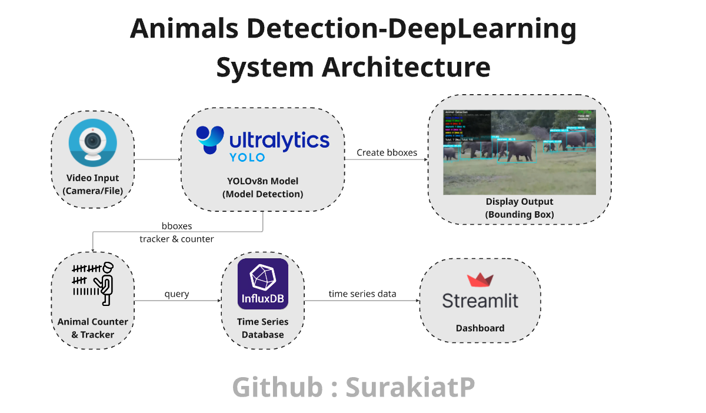

### Project Structure
```
animal_detection_project/
├── main.py                 # Main application
├── requirements.txt        # Dependencies
├── README.md              # Documentation
├── models/
│   └── yolov8n.pt         # Pre-trained model
├── src/
│   ├── __init__.py        # Package initialization
│   ├── detector.py        # Detection logic
│   ├── database.py        # InfluxDB operations
│   └── dashboard.py       # Streamlit dashboard
├── config/
│   └── config.yaml        # Configuration file
├── data/
│   ├── videos/           # Test videos
│   └── images/           # Test images
└── output/                # Output videos
```

## Detection Examples

The system can detect and classify the following 7 animal types with bounding boxes:

### Horse (COCO ID: 17)

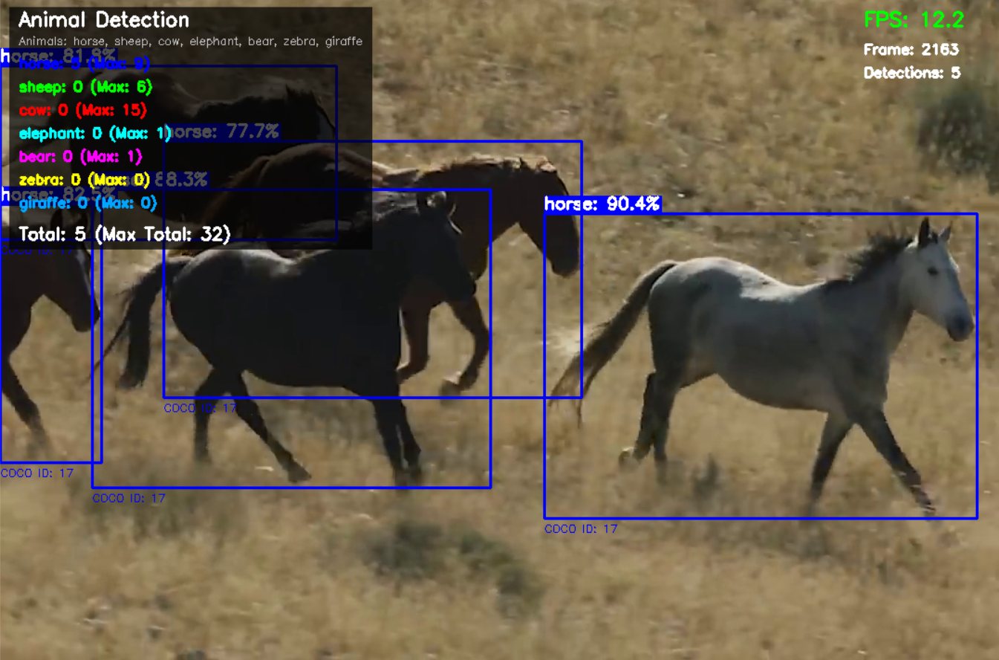

```
Detection: Horse
COCO ID: 17
```

### Sheep (COCO ID: 18)

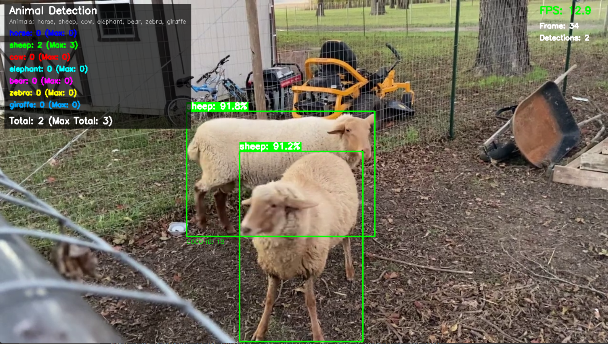

```
Detection: Sheep
COCO ID: 18
```

### Cow (COCO ID: 19)

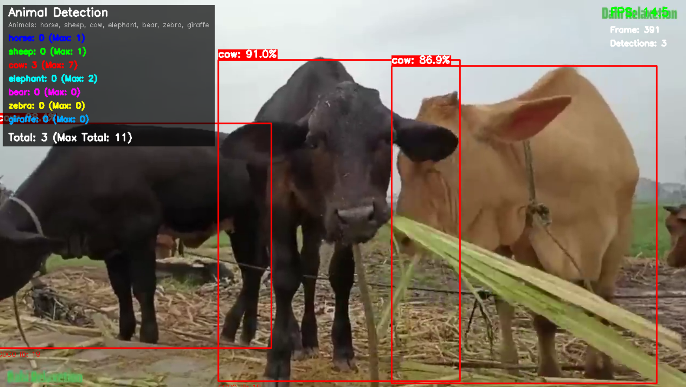

```
Detection: Cow
COCO ID: 19
```

### Elephant (COCO ID: 20)

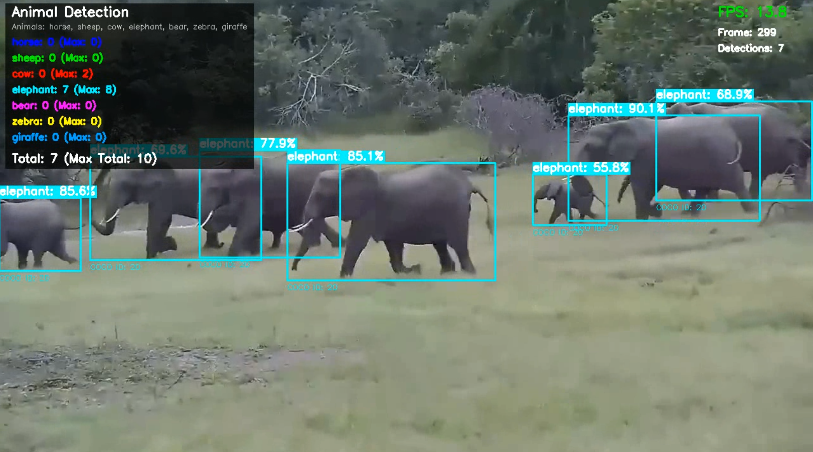

```
Detection: Elephant
COCO ID: 20
```

### Bear (COCO ID: 21)

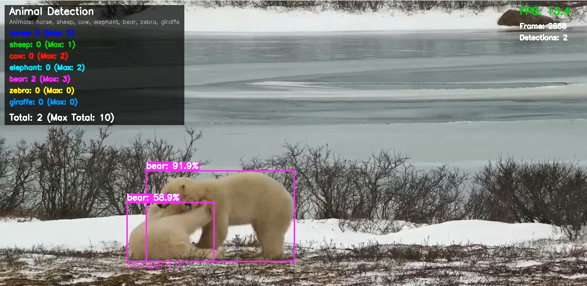

```
Detection: Bear
COCO ID: 21
```

### Zebra (COCO ID: 22)

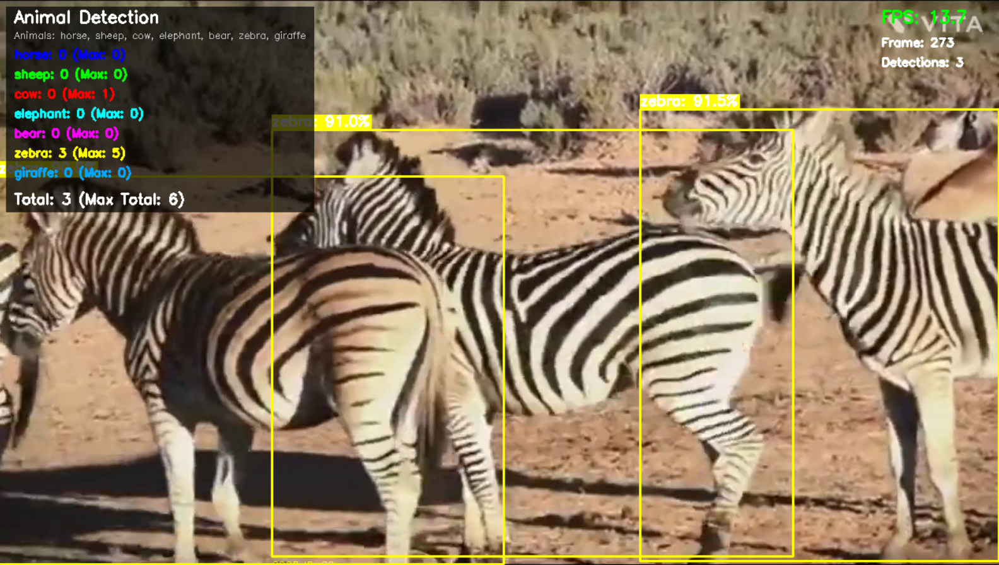

```
Detection: Zebra
COCO ID: 22
```

### Giraffe (COCO ID: 23)

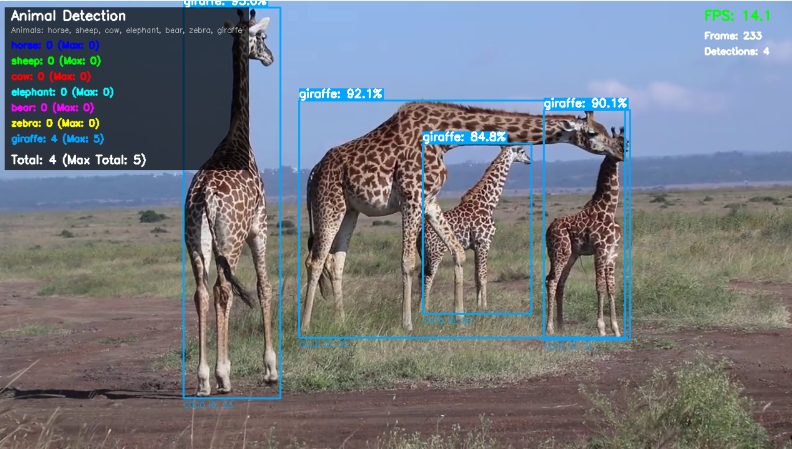

```
Detection: Giraffe
COCO ID: 23
```

## Dashboard Screenshots

### InfluxDB Database Interface

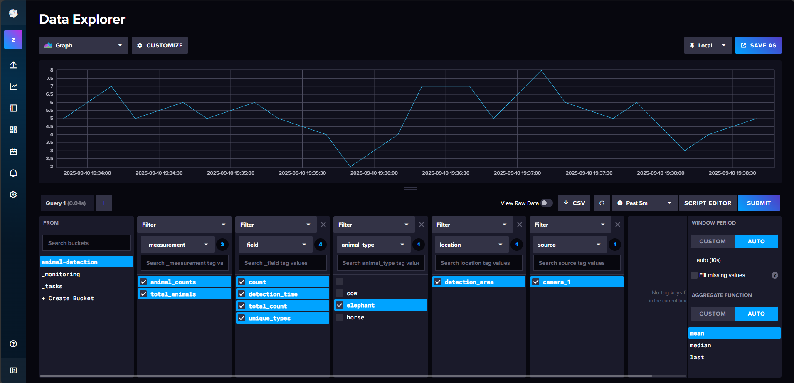

```
- Real-time data storage
- Time-series animal count data
- System performance metrics
- Query interface for data analysis
```

### Streamlit Dashboard

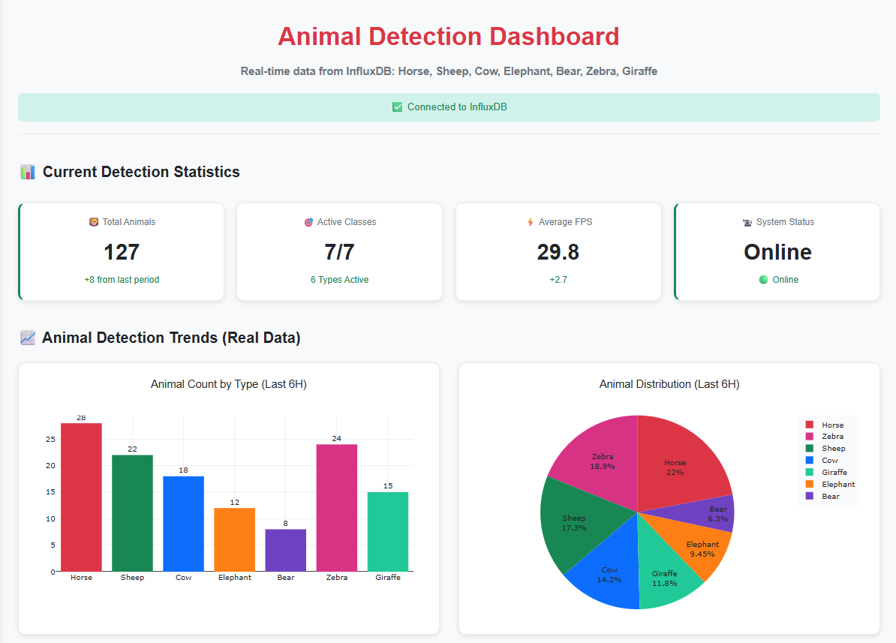

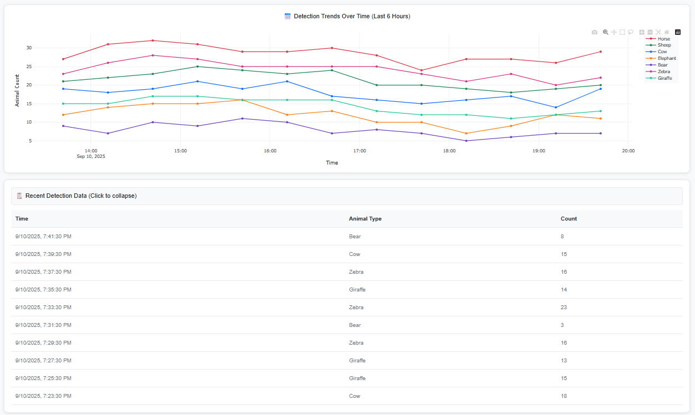

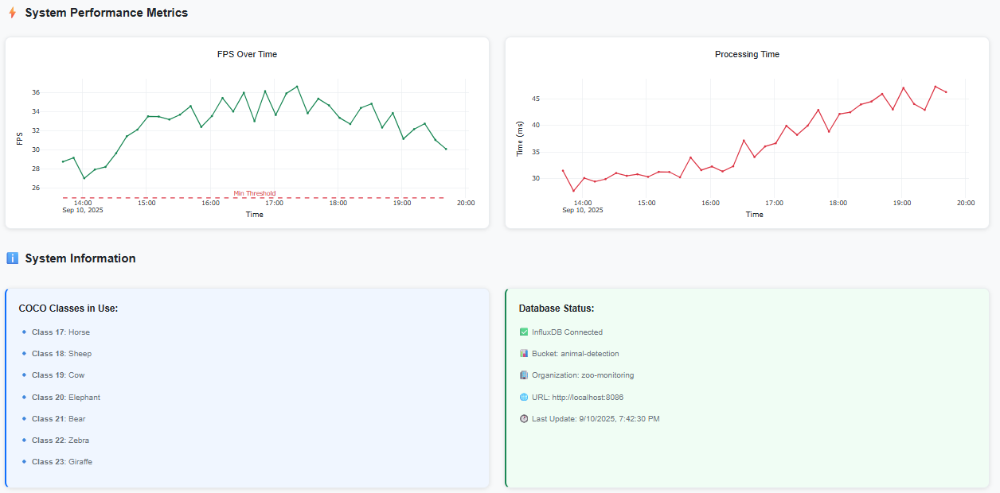

```
1. Current Detection Statistics (metrics cards)
2. Animal Detection Trends (bar chart and pie chart)
3. Detection Trends Over Time (time series chart)
4. System Performance Metrics (FPS and processing time)
5. Database connection status
6. Recent detection data table
```

## Features

- **Real-time Animal Detection**: Live detection from webcam or video files
- **7 Animal Classes**: Horse, Sheep, Cow, Elephant, Bear, Zebra, Giraffe
- **Bounding Box Visualization**: Clear visual indication of detected animals
- **Animal Counting**: Track and count animals per frame and over time
- **Confidence Scoring**: Display detection confidence for each animal
- **Data Storage**: Store detection data in InfluxDB time-series database
- **Interactive Dashboard**: Real-time Streamlit dashboard with charts and metrics
- **Performance Monitoring**: Track FPS, processing time, and system performance
- **Configurable Settings**: Easy configuration through YAML file
- **Multiple Input Sources**: Support for webcam, video files, and IP cameras

## Prerequisites

- Python 3.8+
- GPU recommended for real-time processing
- 4GB RAM minimum
- InfluxDB 2.7+ (Docker recommended)

## Installation

1. **Clone the repository:**
```bash
git clone https://github.com/SurakiatP/animals-detection-DeepLearning.git
cd animal_detection_project
```

2. **Create virtual environment:**
```bash
# If your use python environment
python -m venv venv
source venv/bin/activate  # Linux/Mac
# or venv\Scripts\activate  # Windows
```

3. **Install dependencies:**
```bash
pip install -r requirements.txt
```

4. **Download YOLOv8n model:**
```bash
python -c "from ultralytics import YOLO; YOLO('yolov8n.pt')"
mv yolov8n.pt models/
```

5. **Setup InfluxDB (Docker):**
```bash
docker run -d -p 8086:8086 \
  -e DOCKER_INFLUXDB_INIT_MODE=setup \
  -e DOCKER_INFLUXDB_INIT_USERNAME=admin \
  -e DOCKER_INFLUXDB_INIT_PASSWORD=password123 \
  -e DOCKER_INFLUXDB_INIT_ORG=zoo-monitoring \
  -e DOCKER_INFLUXDB_INIT_BUCKET=animal-detection \
  --name influxdb \
  influxdb:2.7
```

## Configuration

Edit `config/config.yaml` to customize settings:

```yaml
model:
  path: "models/yolov8n.pt"
  confidence_threshold: 0.5

animals:
  classes:
    - coco_id: 17
      name: "horse"
      color: [255, 0, 0] # Bounding Box color
    - coco_id: 18
      name: "sheep"
      color: [0, 255, 0]
    - coco_id: 19
      name: "cow"
      color: [0, 0, 255]
    - coco_id: 20
      name: "elephant"
      color: [255, 255, 0]
    - coco_id: 21
      name: "bear"
      color: [255, 0, 255]
    - coco_id: 22
      name: "zebra"
      color: [0, 255, 255]
    - coco_id: 23
      name: "giraffe"
      color: [255, 165, 0]

influxdb:
  url: "http://localhost:8086"
  token: "your-influxdb-token"
  org: "zoo-monitoring"
  bucket: "animal-detection"

video:
  source: "your-path-to-video" # 0 for webcam, or path to video file
  save_output: true
  output_path: "output/your-file-name"

dashboard:
  host: "localhost"
  port: 8501
  auto_refresh: 30  # seconds
```

## Usage

### 1. Run Animal Detection System:
```bash
python main.py
```

**Controls:**
- Press `q` to quit
- Press `s` to save current statistics
- Press `i` to show detection info

### 2. Run Dashboard (in separate terminal):
```bash
streamlit run src/dashboard.py
```

Access dashboard at: `http://localhost:8501`

### 3. View InfluxDB Data:
Access InfluxDB UI at: `http://localhost:8086`
- Username: admin
- Password: password123

## Performance

- **Processing Speed**: 25-120 FPS (depending on hardware)
- **Detection Accuracy**: ~90%+ for clear animal images
- **Supported Video Formats**: MP4, AVI, MOV
- **Real-time Capability**: Yes (with recommended hardware)

## Troubleshooting

### Common Issues:

1. **Video source not found:**
   - Check camera is connected
   - Try different video source index (0, 1, 2...)
   - Verify video file path

2. **InfluxDB connection failed:**
   - Ensure InfluxDB is running: `docker ps | grep influxdb`
   - Check URL and credentials in config.yaml

3. **Low FPS performance:**
   - Lower video resolution
   - Use smaller YOLOv8 model (yolov8n)
   - Enable GPU acceleration

4. **Import errors:**
   - Verify all dependencies installed: `pip install -r requirements.txt`
   - Check Python virtual environment is activated

## Technical Stack

- **Deep Learning Framework**: Ultralytics YOLOv8
- **Computer Vision**: OpenCV
- **Database**: InfluxDB 2.7
- **Dashboard**: Streamlit
- **Visualization**: Plotly
- **Data Processing**: Pandas, NumPy
- **Configuration**: YAML

## License

This project is licensed under the MIT License.

## Author

**Surakiat Kansa-ard**
- GitHub: [https://github.com/SurakiatP](https://github.com/SurakiatP)
- LinkedIn: [https://www.linkedin.com/in/surakiat-kansa-ard-171942351/](https://www.linkedin.com/in/surakiat-kansa-ard-171942351/)

## Acknowledgments

- Ultralytics for YOLOv8 model
- COCO Dataset for pre-trained weights
- InfluxDB for time-series database
- Streamlit for dashboard framework

---

**Note**: This project is designed for educational and research purposes. For production use, consider additional validation and testing with your specific use cases.